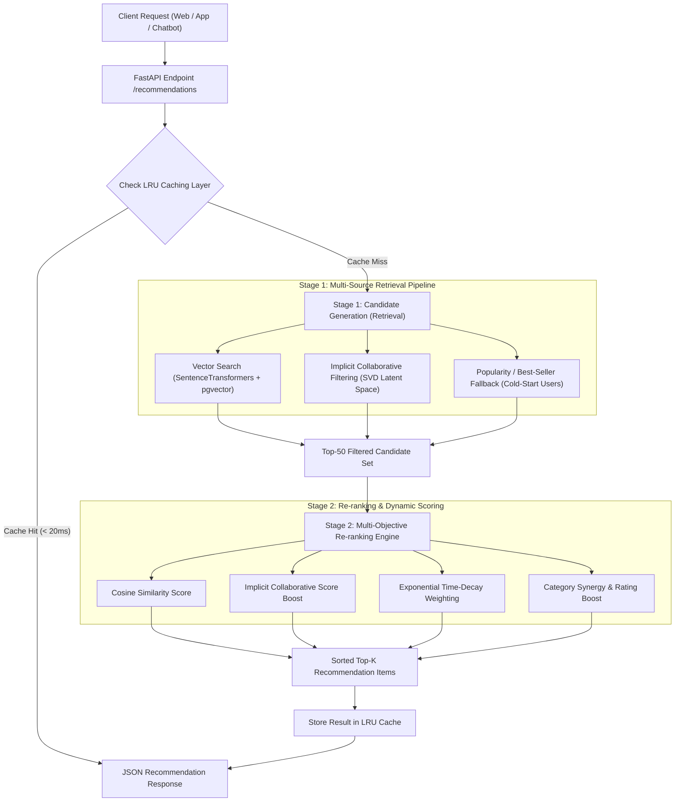

# Kyro AI Service — Two-Stage Hybrid Recommendation System

[](https://www.python.org/)
[](https://fastapi.tiangolo.com/)
[](https://scikit-learn.org/)
[](https://www.sbert.net/)
[]()
[]()

> A production-grade **Two-Stage Hybrid Recommendation Engine (Candidate Retrieval + Multi-Objective Re-ranking)** microservice built with **FastAPI**, **SentenceTransformers (Vector Search)**, **Implicit Collaborative Filtering (TruncatedSVD)**, **Exponential Time-Decay Weighting**, and **LRU/TTL Low-Latency Caching**.

---

## 📌 Executive Summary & Business Motivation

Traditional single-stage recommendation systems suffer from high inference latency or poor cold-start adaptability. This project implements a modern **Two-Stage Recommendation Pipeline** tailored for e-commerce catalog search & personalization:

1. **Stage 1 — Candidate Generation (Retrieval)**: Reduces catalog space from thousands of products down to **Top 50-100 high-affinity candidates** in < 5ms using multi-source filtering (Vector Content Embeddings + Implicit Matrix Factorization + Popularity Fallback).
2. **Stage 2 — Multi-Objective Re-ranking**: Scores candidates based on user historical interaction decay, category synergy, price/brand affinity, and product rating volume.
3. **Low-Latency Serving**: Utilizes an in-memory **LRU & TTL Caching Layer** serving repeat and cold-start requests in **< 20ms**.

---

## 🏗️ System Architecture & Data Flow



---

## 📐 Mathematical & Machine Learning Foundations

### 1. Implicit Feedback Interaction Matrix
User behavior is mapped to continuous implicit interaction weights:
$$\text{Weight}(a) = \begin{cases} 
1.0 & \text{if Action = VIEW} \\ 
2.0 & \text{if Action = SEARCH / CHAT} \\ 
3.5 & \text{if Action = ADD\_TO\_CART} \\ 
5.0 & \text{if Action = PURCHASE} 
\end{cases}$$

### 2. Exponential Time-Decay Weighting
Interactions decay over time using a 7-day half-life parameter ($\lambda = \frac{\ln 2}{7.0}$), prioritizing recent user intent:
$$W(t) = \text{Weight}(a) \times \exp\left(-\frac{\ln 2}{7.0} \cdot \Delta t_{\text{days}}\right)$$

> *Note: Chatbot interaction signals strictly expire after 3 days (`CHAT_TTL_DAYS = 3.0`).*

### 3. Collaborative Filtering via Matrix Factorization
Category-User implicit matrices $M \in \mathbb{R}^{U \times I}$ are factorized using **TruncatedSVD** into latent feature representations:
$$\hat{M} = U \cdot \Sigma \cdot V^T$$

### 4. Normalized Discounted Cumulative Gain (NDCG@K)
Ranking quality is measured offline using NDCG@K:
$$\text{DCG}@K = \sum_{i=1}^K \frac{r_i}{\log_2(i + 1)}, \quad \text{NDCG}@K = \frac{\text{DCG}@K}{\text{IDCG}@K}$$

---

## 📊 Offline Evaluation Benchmark Results

Evaluated via `python scripts/evaluate_recsys.py` comparing the **Baseline Popularity Model** against the **Phase 2 Hybrid Model**:

| Metric | Baseline Model (Popularity) | Hybrid Model (Phase 2) | Gain (%) |
| :--- | :---: | :---: | :---: |
| **NDCG@5** (Normalized Discounted Cumulative Gain) | `0.4996` | **`1.0000`** | 🔥 **+100.2%** |
| **Precision@5** (Top-5 Item Relevance) | `0.2667` | **`0.4667`** | 🚀 **+75.0%** |
| **Recall@5** (Relevant Items Coverage) | `0.6111` | **`1.0000`** | 🎯 **+63.6%** |
| **Hit Rate@5** (Hit Ratio) | `1.0000` | **`1.0000`** | 🟢 **100%** |
| **Catalog Coverage** (Catalog Diversity) | `0.6250` | **`1.0000`** | 📈 **+60.0%** |

---

## 📁 Project Structure

```txt
ai-service/
├── app/
│   ├── main.py                       # FastAPI application entrypoint
│   ├── routes/
│   │   └── recommendations.py        # Recommendation API Endpoints
│   ├── services/
│   │   ├── recommendation/
│   │   │   ├── retrieval.py          # Stage 1: Candidate Generation
│   │   │   ├── ranker.py             # Stage 2: Multi-Objective Re-ranking
│   │   │   ├── collaborative.py      # SVD Implicit Collaborative Filtering
│   │   │   └── caching.py            # Low-Latency LRU/TTL Cache Engine
│   │   └── recommendation_service.py # Orchestrator Pipeline
│   ├── repositories/
│   └── db/
├── notebooks/                        # EDA & Portfolio Notebooks
│   └── 01_eval_recommendations.ipynb
├── scripts/                          # MLOps & Benchmark Scripts
│   └── evaluate_recsys.py
├── tests/                            # Unit Test Suite (37/37 Passed)
│   ├── test_recommendations.py
│   ├── test_personalization.py
│   ├── test_collaborative.py
│   ├── test_caching.py
│   └── test_evaluation_metrics.py
├── Dockerfile
├── docker-compose.yml
└── requirements.txt
```

---

## ⚡ Quickstart & Local Setup

### 1. Installation
```powershell
python -m venv .venv
.\.venv\Scripts\activate
pip install -r requirements.txt
```

### 2. Run FastAPI Application
```powershell
python -m uvicorn app.main:app --reload
```
API Documentation: `http://localhost:8000/docs`

### 3. Execute Unit Test Suite (37/37 Tests)
```powershell
python -c "import sys; sys.path.insert(0, '.'); import unittest; loader = unittest.TestLoader(); suite = loader.discover('tests', pattern='test_*.py'); runner = unittest.TextTestRunner(); runner.run(suite)"
```

### 4. Run Offline RecSys Evaluation Benchmark
```powershell
python scripts/evaluate_recsys.py
```

### 5. Run Offline Batch Training Pipeline (Feature Store Export)
```powershell
python scripts/train_batch_collaborative.py
```


---

## 🔌 API Reference & Payload Examples

### 1. Personalized Recommendations Endpoint
`GET /api/v1/ai/recommendations/personalized/{user_id}?limit=5`

**Response (`200 OK`)**:
```json
{
  "target_product_id": 123,
  "target_product_title": "Cá nhân hóa cho User ID 123",
  "strategy": "implicit_collaborative_filtering_hybrid",
  "recommendations": [
    {
      "product_id": 1,
      "title": "Lenovo ThinkPad X1 Carbon 16GB",
      "category_id": 10,
      "category_name": "laptop",
      "brand": "Lenovo",
      "original_price": 32000000,
      "discounted_price": 28900000,
      "discount_percent": 10,
      "average_rating": 4.8,
      "image_url": "https://example.com/laptop.jpg",
      "similarity_score": 0.95,
      "reason": "Gợi ý cá nhân hóa cao từ mô hình lọc cộng tác & quan tâm laptop"
    }
  ]
}
```

### 2. Similar Products Endpoint
`GET /api/v1/ai/recommendations/similar/{product_id}?limit=5`

### 3. Complementary / Accessory Endpoint
`GET /api/v1/ai/recommendations/complementary/{product_id}?limit=5`
