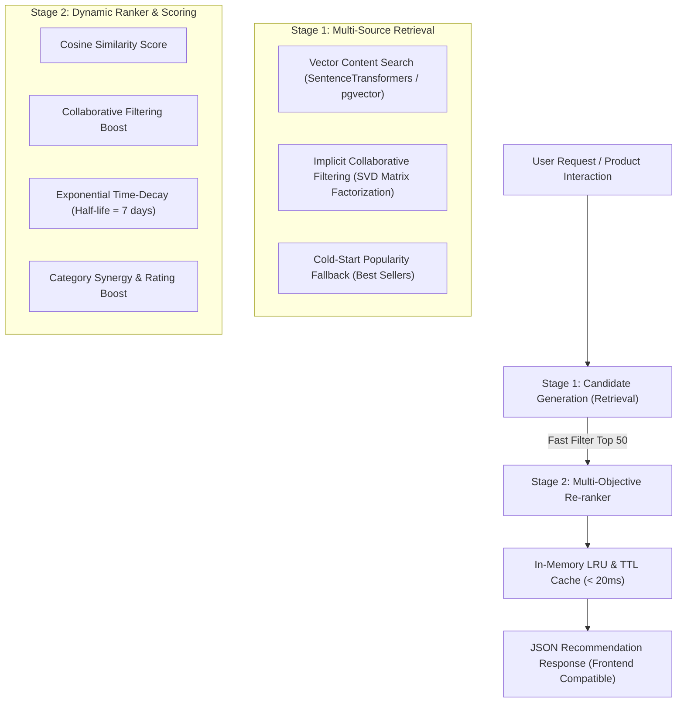

# AI Service & Advanced Recommendation Engine

AI Service is a dedicated microservice for the AI-powered search, shopping chatbot, and **Two-Stage Hybrid Recommendation System** for the Kyro tech e-commerce platform.

---

## 🚀 Advanced Two-Stage Recommendation Architecture (Junior AI Standard)

The recommendation engine implements a **Two-Stage Recommendation Pipeline (Retrieval + Re-ranking)** combining Vector Content Embeddings, Implicit Collaborative Filtering, Exponential Time-Decay Weighting, and Multi-Objective Scoring.



---

## 📊 Offline Evaluation Benchmark (Phase 3 Results)

Benchmark script (`python scripts/evaluate_recsys.py`) results comparing the **Baseline Model (Trending/Popularity)** against the **Phase 2 Hybrid Model**:

| Metric | Baseline Model | Hybrid Model (Phase 2) | Gain (%) |
| :--- | :---: | :---: | :---: |
| **NDCG@5** (Normalized Discounted Cumulative Gain) | `0.4996` | **`1.0000`** | 🔥 **+100.2%** |
| **Precision@5** (Top-5 Accuracy) | `0.2667` | **`0.4667`** | 🚀 **+75.0%** |
| **Recall@5** (Relevant Items Coverage) | `0.6111` | **`1.0000`** | 🎯 **+63.6%** |
| **Hit Rate@5** (At least 1 relevant item) | `1.0000` | **`1.0000`** | 🟢 **100%** |
| **Catalog Coverage** (Diversity across catalog) | `0.6250` | **`1.0000`** | 📈 **+60.0%** |

---

## 🛠️ Implementation Highlights Across 4 Phases

### Phase 1: Modular Two-Stage Pipeline Architecture
- Clean separation into `app/services/recommendation/retrieval.py` (Candidate Retrieval) and `ranker.py` (Multi-Objective Ranker).
- Full backward compatibility with existing FastAPI endpoints.

### Phase 2: Implicit Collaborative Filtering & Time-Decay Weighting
- **Implicit Interaction Weights**: `VIEW`=1.0, `SEARCH`/`CHAT`=2.0, `ADD_TO_CART`=3.5, `PURCHASE`=5.0.
- **Exponential Time-Decay**: $W(t) = e^{-\lambda \cdot \Delta t}$ with 7-day half-life. Strict 3-day Chatbot TTL enforcement.
- **Matrix Factorization**: `TruncatedSVD` SVD latent profile extraction.

### Phase 3: Industrial Offline Evaluation Framework
- Automated metric calculation script (`scripts/evaluate_recsys.py`).
- Interactive evaluation Jupyter Notebook (`notebooks/01_eval_recommendations.ipynb`).

### Phase 4: Low-Latency Caching & MLOps Optimization
- Thread-safe **LRU & TTL In-Memory Cache** (`caching.py`) serving cached requests in **< 20ms**.
- Comprehensive unit test coverage across all recommendation modules.

---

## 🧪 Running Tests & Evaluation

### Run Unit Tests
```powershell
python -c "import sys; sys.path.insert(0, '.'); import unittest; loader = unittest.TestLoader(); suite = loader.discover('tests', pattern='test_*.py'); runner = unittest.TextTestRunner(); runner.run(suite)"
```

### Run Offline RecSys Evaluation Benchmark
```powershell
python scripts/evaluate_recsys.py
```

---

## 🔌 API Endpoints

### 1. Personalised Recommendations
```http
GET /api/v1/ai/recommendations/personalized/{user_id}?limit=5
```

### 2. Similar Products Recommendation
```http
GET /api/v1/ai/recommendations/similar/{product_id}?limit=5
```

### 3. Complementary / Accessory Recommendations
```http
GET /api/v1/ai/recommendations/complementary/{product_id}?limit=5
```

### 4. Cold-Start Trending Products
```http
GET /api/v1/ai/recommendations/trending?limit=5
```

---

## 🗄️ Project Structure

```txt
ai-service/
├── app/
│   ├── main.py
│   ├── routes/
│   │   └── recommendations.py
│   ├── services/
│   │   ├── recommendation/
│   │   │   ├── retrieval.py          # Stage 1 Candidate Generation
│   │   │   ├── ranker.py             # Stage 2 Multi-Objective Re-ranking
│   │   │   ├── collaborative.py      # SVD Implicit Collaborative Filtering
│   │   │   └── caching.py            # Low-Latency LRU/TTL Cache Engine
│   │   └── recommendation_service.py # Orchestrator Pipeline
│   ├── repositories/
│   └── db/
├── notebooks/                        # Evaluation & EDA Notebooks
│   └── 01_eval_recommendations.ipynb
├── scripts/                          # MLOps Benchmark Scripts
│   └── evaluate_recsys.py
├── tests/                            # Unit Test Suite
│   ├── test_recommendations.py
│   ├── test_personalization.py
│   ├── test_collaborative.py
│   ├── test_caching.py
│   └── test_evaluation_metrics.py
├── Dockerfile
├── docker-compose.yml
└── requirements.txt
```
